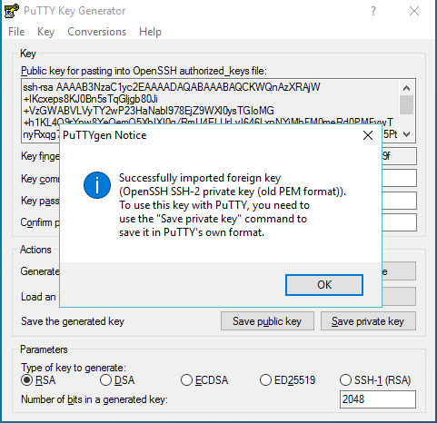
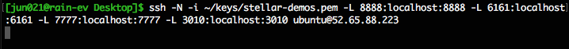

# Connecting to your Stellar Demo Platform

The following instructions can be used  to connect to a _Stellar_ server, either
to get console access (to install, start,  stop or configure the platform) or to
gain browser access to the UI and Python notebook.

## Connecting with a web browser

When working on a remote client machine, connecting to the Stellar server through 
a web browser installed on the client is the recommended procedure.

To make  the connection  possible, together  with a web  browser, software to
create encrypted SSH _tunnels_ (also known  as _port forwarding_) is required on
the client machine. 

The general procedure is therefore:

1. Build  a tunnel connection  to the server,  forwarding ports 6161  (main UI),
   7777 (file sharing), 8888 (Python notebook) and 3010 (Search UI). For Windows, this is described [here](./remote.md#connecting-from-windows). For macOS or Linux, this is described [here](./remote.md#connecting-to-macos-or-linux).
2. Start the local browser and open the following links in separate tabs:
  * [Web UI](http://127.0.0.1:6161)
  * [File transfer - if installed](http://127.0.0.1:7777)
  * [Python notebook](http://127.0.0.1:8888)
  * [Search UI](http://127.0.0.1:3010)

__Note:__ at the moment the only officially supported browser is [Google
Chrome](https://www.google.com/chrome/).

The  remainder of  this  document details  the steps  and  required software  to
created a tunnel connection on Linux, macOS and Windows systems.

This procedure was tested, and is guaranteed to work, only on the following systems:

- macOS Sierra or HighSierra, with default SSH client
- Ubuntu Linux 16.04, with default SSH client
- Windows 10, with PuTTY v0.70

### Additional software

The abovementioned is sufficient for importing data into Stellar, triggering the
graph analytics pipeline and retrieving the results.  To visualize the output of
certain operations a client application capable of displaying
[GDF](https://gephi.org/users/supported-graph-formats/gdf-format/) and
[GraphML](https://gephi.org/users/supported-graph-formats/graphml-format/) is
required.

The recommended  application, which has  been tested with _Stellar_  output data
formats, is [Gephi](https://gephi.org).

## Connecting from Windows 

Download and install PuTTY <https://www.putty.org>. You will need PuTTYgen and the PuTTY SSH client itself to connect to the remote machine.

### PuTTYgen

If you have a _.pem_ file, the private key format generate by AWS EC2, you can convert it into a format that can be used by PuTTY using PuTTYgen (_.ppk_). 

To convert your private key:

1. Start PuTTYgen.
2. Under **Type of key to generate**, choose **RSA** 

    

3. Import the _.pem_ file.

    

4. Save private key.

    

### PuTTY

You can now connect to the remote machine via PuTTY.

1. Start PuTTY.
2. Fill in the host name.

    

3. Navigate to the _Auth_ section and locate your private key file for authentication.

    

4. Navigate to the _Tunnels_ section to add 6161, 7777, 8888 and 3010 as new forwarded ports.

__Note:__ 4 ports must be forwarded, but only 3 are visible in the screenshot below.

    

5. Click **Open** to connect.

    

## Connecting from macOS or Linux

1. Open a terminal.

2. Use the **ssh** command to connect to the remote machine.

    

3. Forward ports 6161, 7777, 8888 and 3010.

    

