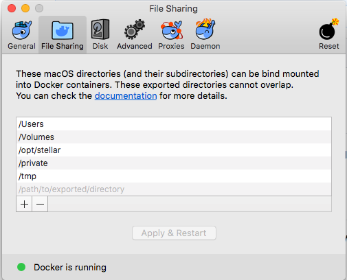
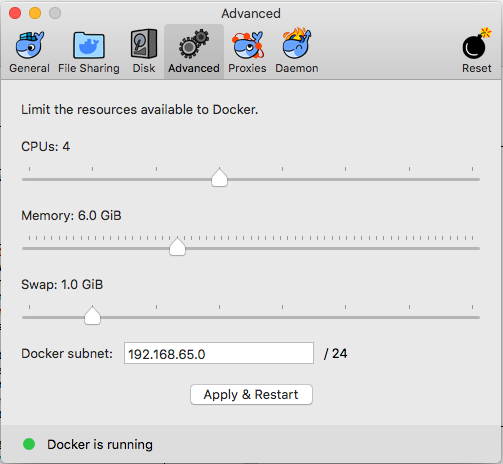

# Troubleshooting Guide

This page contains notes for troubleshooting the deployment of Stellar. Investigations from particular troubleshooting experiences can be documented here if it could be relevant for others in the future.

## Mac Installation - Additional Instructions

Mac installation is a use-case most common when someone wants to install Stellar on their own laptop. Most of the Ubuntu installation instructions can be adapted for equivalent steps on MacOS, but using *Docker for Mac* is where the differences become more consequential.

Two pieces need configuring in *Docker for Mac* preferences:
* Preferences -> File Sharing -> Add `/opt/stellar` directory -> Apply & Restart

    

* Preferences -> Advanced -> Memory -> Set slider to 6.0 GiB -> Apply & Restart

    

